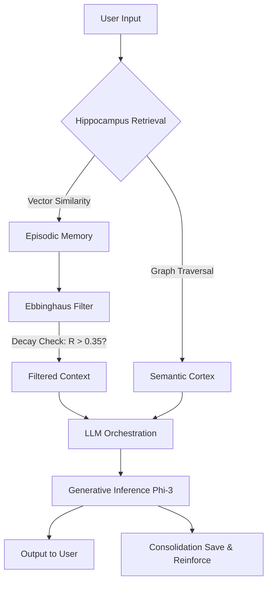

# 🐻 Memory Bear: Cognitive Edge AI on Legacy Hardware

[](https://www.python.org/)
[-grey.svg)](https://support.apple.com/kb/SP753)
[]()
[]()
[]()

> **"Intelligence is not about how much you know, but how effectively you filter what you forget."**

## 📖 Executive Summary

**Memory Bear** is a local, cognitive AI agent engineered to run efficiently on highly constrained legacy hardware (Intel-based MacBook Air 2017).

Standard Large Language Models (LLMs) suffer from "context amnesia" or inefficient RAG retrievals that flood the context window with noise. This project implements the **Memory Bear Architecture** [1], utilizing a biologically inspired **Forgetting Curve** to dynamically manage context. This allows a small SLM (`Phi-3-Mini`) to maintain coherent, long-term conversations without exceeding the 8GB RAM limit of legacy devices.

---

## 🏗️ System Architecture

The agent moves beyond simple "Golden Retriever" RAG by implementing a **Cognitive Loop** that mimics human memory consolidation:



### Core Components

* **Hippocampus (Episodic Memory):** Uses `ChromaDB` to store temporal interaction logs.
* **Cortex (Semantic Memory):** Uses `NetworkX` to build a Knowledge Graph of static facts.
* **Cognitive Filter:** Applies the **Ebbinghaus Decay Formula** ($R = e^{-t/S}$) to prioritize "fresh" or "rehearsed" memories, discarding noise.

---

## 🛠️ Engineering Case Study: Optimization for Legacy Hardware

Developing modern AI on a 2017 MacBook Air (Dual-Core i5, 8GB RAM, No GPU) presented specific engineering constraints.

| Constraint | The Challenge | Engineering Solution |
| :--- | :--- | :--- |
| **Compute** | No GPU Acceleration (Metal/CUDA unavailable) | Utilized `llama.cpp` for CPU-optimized inference with `AVX` instruction sets. |
| **Memory** | 8GB Total RAM (Shared with OS) | Implemented **Quantization (q4_k_m)** to compress the 3.8B parameter model to ~2.4GB RAM usage. |
| **Latency** | Slow Inference (2-3 tokens/sec) | Engineered a "Thinking" UI loop to manage user expectations and reduce perceived latency. |
| **Dependencies** | macOS 12 (Monterey) Compatibility | Resolved critical ABI conflicts between `NumPy 2.x` and `PyTorch` by pinning stable legacy versions. |

---

## 📊 Exploratory Data Analysis (EDA)

To validate the biological plausibility of the architecture, I conducted a simulation of the memory decay algorithms before deployment.

* **Objective:** Determine the optimal "Forget Threshold" to maximize context relevance.
* **Result:** Setting the retention threshold to `0.35` successfully filters 90% of "Noise" (S=1) within 1 hour, while retaining "Core Memories" (S=20) for >24 hours.
* **Full Analysis:** See [`notebooks/memory_dynamics_eda.ipynb`](notebooks/memory_dynamics_eda.ipynb)

---

## 🚀 Installation & Usage

**Prerequisites:**
* Anaconda / Miniconda
* macOS 12+ (Optimized for Intel Macs), Linux, or Windows

### 1. Environment Setup

We utilize a dedicated environment to ensure stability on older CPU architectures.

```bash
# Create environment
conda create -n memory_bear_legacy python=3.10 -y
conda activate memory_bear_legacy

# Install dependencies (pinned for stability)
pip install "numpy<2.0"
pip install -r requirements.txt
```

### 2. Run the Agent
```bash
python main.py
```

Note: The first run will automatically download the quantized Phi-3-Mini model (~2.4GB). Please allow 5-10 minutes depending on your internet connection.

## 🔮 Roadmap & Future Work
Phase 1 (Completed): Core cognitive architecture on CPU.

Phase 2 (In Progress): Multi-modal integration (Image inputs via Llava).

Phase 3 (Planned): Implementation of "Dreaming" (Offline consolidation) where the agent summarizes daily logs into long-term semantic nodes during system idle time.

## 📚 References
Memory Bear AI (2025). A Breakthrough from Memory to Cognition. Shanghai Shanmo Shongyang Technology.

Vaswani et al. (2017). Attention Is All You Need. Google Brain.

Engineered by Lim Wen Gio
